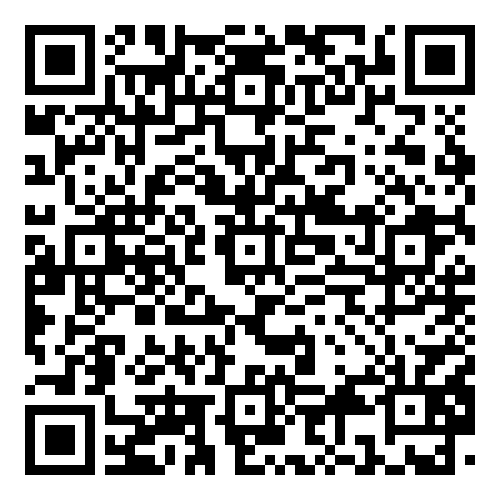

# AstroObs Seminar — Interactive data visualisation for teaching and outreach

This repository contains materials for the AstroObs interactive seminar (April 2026). It includes Jupyter notebooks and a Streamlit app, "Mundus ex Machina", for visualising cosmological quantities for teaching and public outreach.

## Contents
- **Streamlit app — "Mundus ex Machina"**: an interactive educational tool for exploring cosmological models and the large-scale structure of the Universe. Sections include:
  - Basics (Hubble parameter, cosmological distances, etc.)
  - Cosmic Microwave Background (including polarization)
  - Galaxy clustering
  - Weak gravitational lensing
- **Notebooks**:
  - Interactive plotting and animation examples (matplotlib, Plotly, Bokeh) using the matter power spectrum
  - Introduction to Streamlit (Can you modify hier, Devang?)
  - Example analysis using Gaussian processes

## QR Code

- **Scan to open the app:** If you have a QR image for the application link, place it at `assets/qr_app_link.png` and it will be displayed here. You can embed it as a link to the running **"Mundus ex Machina"**
[](https://interactiveseminar2442026newcastle-q7bxxkdrwkxxefeujetafd.streamlit.app/)

## How to run

1. Clone the repository:

    ```bash
    git clone git@github.com:Rintaro0406/Interactive_Seminar_24_4_2026_Newcastle.git
    cd interactive_seminar_24_4_2026
    ```

2. Create and activate a Python environment (Conda recommended):

    ```bash
    conda create -n interactive_seminar_env python=3.14 -y
    conda activate interactive_seminar_env
    ```

   Alternatively, use `python -m venv .venv` and `source .venv/bin/activate`.

3. Install the required Python packages:

    ```bash
    pip install -r requirements.txt
    ```

4. Run the Streamlit app:

    ```bash
    cd mundus_ex_machina
    streamlit run mundus_ex_machina.py
    ```

5. Open the app in your browser at the URL shown by Streamlit (typically http://localhost:8501).


If you'd like, I can add the QR image you uploaded into `assets/qr_app_link.png` and replace `<APP_URL>` with the actual link — tell me if you want me to do that.

## Notes
- The repository was prepared for teaching and demonstration; some notebooks include developer notes you can adapt.

# Important links

### Visualization packages
- **Matplotlib:** [https://matplotlib.org/](https://matplotlib.org/) — A mature plotting library for publication-quality figures, animations, and interactive use in notebooks.
- **Streamlit:** [https://streamlit.io/](https://streamlit.io/) — Simple framework for building interactive data apps and dashboards with minimal code.
- **Plotly:** [https://plotly.com/](https://plotly.com/) — Interactive, web-ready plotting library (Plotly.py) for rich graphs and dashboards.
- **Dash:** [https://dash.plotly.com/](https://dash.plotly.com/) — Framework for building analytical web applications using Plotly visualizations and React components.
- **Bokeh:** [https://bokeh.org/](https://bokeh.org/) — Library for creating interactive, browser-based visualizations with high-performance streaming.

### Cosmology & astrophysics packages
- **healpy:** [https://healpy.readthedocs.io/en/latest/](https://healpy.readthedocs.io/en/latest/) — Python interface to HEALPix for working with full-sky maps (CMB, foregrounds, geophysics) and spherical harmonics.
- **CLASS:** [http://class-code.net/](http://class-code.net/) — Boltzmann solver for computing cosmological observables (CMB, matter power spectra); often used via `classy` Python wrapper.
- **CAMB:** [https://camb.info/](https://camb.info/) — Code for Anisotropies in the Microwave Background; alternative Boltzmann solver for matter fluctuation/CMB calculations.
- **GLASS:** [https://glass.readthedocs.io/stable/index.html](https://glass.readthedocs.io/stable/index.html) — Tools for galaxy/graviational lensing and survey simulations (check project docs for specific modules).